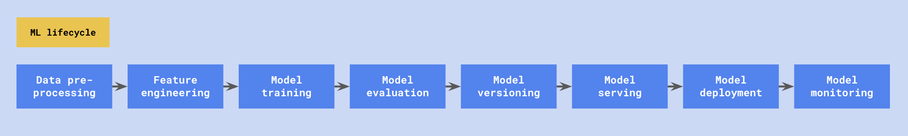
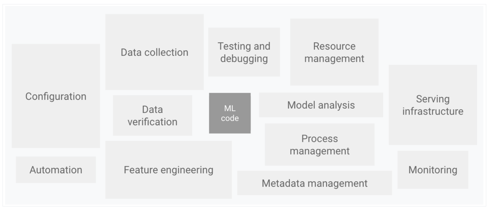

## 1 ML Services on the Public Cloud

Not all ML services are built the same. As a consultant working in the public cloud, I can tell you that you are spoilt for options for Artificial Intelligence (AI) / Machine Learning (ML) tooling on the 3 big public clouds, Azure, AWS, and GCP.

It can be overwhelming to process and synthesize the wave of information; especially when these services are constantly coming out with new features.

Just imagine how much of a nightmare it would be to explain to a layman which platform to choose, and why you chose to use this particular tool to solve your machine learning problem.

I'm writing this post to alleviate that problem statement for others, as well as for myself, so you walk away with a succinct and distilled understanding of what the public cloud has to offer. For the sake of simplicity, I will use the terms AI and ML interchangeably throughout this post.

## 2 Building a Custom ML System... should be a Last Resort

Before we jump into tooling comparison, let's understand why we should even use managed services on the public cloud. It's a valid assumption to question - 
Why not build your own custom infrastructure and ML model from scratch? To answer this question, let's take a quick look at the ML lifecycle.

The below diagram depicts a typical ML lifecycle (the cycle is iterative):

As you can see, there are many parts to the entire lifecycle that must be considered. 

A [famous paper published by Google](https://papers.nips.cc/paper/5656-hidden-technical-debt-in-machine-learning-systems.pdf) showed that a small fraction of the effort that goes into building maintainable ML models in production is writing the model training code. 

This phenomenon is known as the hidden technical debt of ML systems in production, and also what has been termed by industry as Machine Learning Operations (MLOps), which has become an umbrella term to refer to the mentioned technical debt. 

Below is a visual explanation to support the above statistics, [adapted from Google's paper](https://cloud.google.com/architecture/mlops-continuous-delivery-and-automation-pipelines-in-machine-learning):

I won't go into a detailed explanation of each stage in the lifecycle, but here's a summarized list of definitions. If you're interested in learning more, I would recommend reading Machine Learning Design Patterns page xx for a detailed answer.


1. **`Data pre-processing`** - prepare data for ML training; data pipeline engineering
2. **`Feature engineering`** - transform input data into new features that are closely aligned with the ML model learning objective
3. **`Model training`** - training and initial validation of ML model; iterate through algorithms, train / test splits, perform hyperparameter tuning
4. **`Model evaluation`** - performance assessed against predetermined evaluation metrics
5. **`Model versioning`** - version control of model artifacts; model training parameters, model pipeline
6. **`Model serving`** - serving model predictions via batch or real-time inference
7. **`Model deployment`** -  automated build, test, deployment to production, and model retraining
8. **`Model monitoring`** - monitor infrastructure, input data quality, and model predictions



The ML lifecycle does not consider the supporting platform infrastructure, which has to be secure from a encryption, networking, and identity and access management (IAM) perspective.

Cloud services provide managed compute infrastructure, development environments, centralized IAM, encryption features, and network protection services that can achieve security compliance with internal IT policies - hence you really should not be building these ML services yourself, and leverage the power of the cloud to add ML capabilities into your product roadmap.


This section illustrates that writing the model training code is a relatively tiny part of the entire ML lifecycle, and actual data prep, evaluation, deployment, and monitoring of ML models in production is difficult. 

Naturally, the conclusion is that building your own custom infrastructure and ML model takes considerable time and effort, and the decision to do so should be a last resort.

## 3 Hierarchy of ML tooling
Here is where leveraging public cloud services come in to fill the gap. There are broadly two offerings these hyperscalers package and provide to customers:


1. 🧰 **AI services. EITHER:**
- 🔨 **`Pre-Trained Standard`** - Use base model only, No Option to customize by bringing your own training data.
- ⚒️ **`Pre-Trained Customizable`** - Can use base model, and Optional customization by bringing your own training data.
- ⚙️ **`Bring Your Own Data`** - Mandatory to bring your own training data.
___
2. 🪛 **ML Platform.**



For the sharper ones reading this post, I have purposefully omitted a few honorable AI service mentions in the hierarchy:
- Data Warehouse built-in ML models which enable ML development using SQL syntax. Further reading can be done on [**BigQuery ML**](https://cloud.google.com/bigquery-ml/docs/introduction), [**Redshift ML**](https://docs.aws.amazon.com/redshift/latest/dg/machine_learning.html), and [**Synapse dedicated SQL pool PREDICT function**](https://learn.microsoft.com/en-us/azure/synapse-analytics/sql-data-warehouse/sql-data-warehouse-predict). These services are meant to be used by data analysts, given that your data is already inside the cloud data warehouse.
- [**AI Builder**](https://learn.microsoft.com/en-us/ai-builder/overview) for Microsoft Power Platform, and [**Amazon SageMaker Canvas**](https://docs.aws.amazon.com/sagemaker/latest/dg/canvas.html). These services are meant to be used by non-technical business users a.k.a. citizen data scientists.
- [**Azure OpenAI**](https://learn.microsoft.com/en-us/azure/cognitive-services/openai/overview) which is nascent service and regulated by Microsoft; you are required to request approval for a trial.


### 3.1 ML Platform 🪛  {#ml-platform}
We will first discuss the ML Platform before discussing AI services. The platform provides auxiliary tooling required for MLOps.

Each public cloud has their own version of the ML Platform:
- Azure - [Azure Machine Learning](https://learn.microsoft.com/en-us/azure/machine-learning/overview-what-is-azure-machine-learning)
- AWS - [Amazon SageMaker](https://docs.aws.amazon.com/sagemaker/latest/dg/whatis-features-alpha.html)
- GCP - [Vertex AI](https://cloud.google.com/vertex-ai/docs/start/introduction-unified-platform)

#### Who is it for?
Persona-wise, this is for the team who has internal data scientist resources, want to build custom state-of-the-art (SOTA) models with their own training data, and develop frameworks to do custom management of MLOps across the ML lifecycle. 

#### How do I use it?
Requirement-wise, the business use case would need them to engineer a custom ML model implementation that AI services in [Section 3.2](#ai-services) do not have the capabilities to meet.


As much as possible, this should not be your first option when looking to leverage a service on the public cloud. 

Even with the ML platform, considerable time and effort has to be invested into learning the features on the ML platform, and writing the code to build out a custom MLOps framework using the hyperscaler software development kits (SDKs).

Instead, first look for an AI service in the next [Section 3.2](#ai-services) that could meet your need.


#### What technology capabilities does the service provide?

When you utilize a cloud platform, you gain access to a completely hyperscaler managed environment that you would otherwise be pulling your hair out trying to get right:
1. **`Managed Compute Infrastructure`** - these are clusters of machines with default environments, containing ubiquitous built-in ML libraries, and cloud-native SDKs. Compute can be used for distributed training, or to power model endpoints for serving batch and real-time predictions.
2. **`Managed Development Environments`** - in the form of Notebooks, or through your choice of IDE given that there is integration with the ML platform.

These host of utilities enable data scientists and ML engineers to fully focus on the ML lifecycle instead of infrastructure configuration and dependency management. 

Built-in libraries and cloud-native SDKs facilitates data scientists writing custom code to do more seamless engineering throughout the ML lifecycle.


**The following table shows the technology features of each cloud ML platform:**
| Capability | Feature | Azure | AWS | GCP | 
|:----------:|:-------:|:-----:|:---:|:---:|
| Graphical User Interface (GUI) | Studio workspace | Azure ML Studio | SageMaker Studio | Vertex AI Workbench |
| Data pre-processing | Data labeling | Azure ML Data Labeling | SageMaker Groud Truth (Plus) | Vertex AI Data Labeling |
| Feature engineering | Feature store | Open-source Feast library | SageMaker Feature Store | Vertex AI Feature Store |
| Feature engineering | Automatic feature engineering | Azure AutoML | SageMaker AutoPilot | Vertex AI AutoML |
| Model evaluation | Model Experiment tracking | Azure ML Experiments | SageMaker Experiments | Vertex AI Experiments / Vertex AI TensorBoard |
| Model evaluation | Automatic Hyperparameter tuning | Azure ML Sweep | SageMaker Hyperparameter Tuning | Vertex AI Vizier |
| ML pipeline orchestration | Pipeline orchestration | Azure ML Pipelines | SageMaker Pipelines | Vertex AI Pipelines |
| Model versioning | Model registry | Azure ML Registry | SageMaker Model Registry | Vertex AI Model Registry |
| Model serving | Model endpoints | Azure ML Endpoints | SageMaker Batch Transform / SageMaker Endpoints | Vertex AI Prediction
| Model deployment | Container registry | Azure Container Registry | Elastic Container Registry | Cloud Artifact Registry |
| Model deployment | Continuous Integration (CI) / Continuous Delivery (CD) | Azure DevOps | CodeCommit, CodeBuild, CodeDeploy, CodePipeline | Cloud Code, Cloud Build, Cloud Deploy |
| Model monitoring | Infrastructure monitoring | Azure Monitor | CloudWatch | Cloud Operations Suite |
| Model monitoring | Concept and data drift | Azure Monitor | SageMaker Model Monitoring | Vertex AI Model Monitoring |
| Model monitoring | Model understanding and interpretability | Azure ML Responsible AI | SageMaker Clarify | Vertex AI Explainable AI |

### 3.2 AI Services 🧰  {#ai-services}
Next, we will discuss AI services. They enable ML development using a low-code / no-code approach, and mitigate the overhead of managing MLOps. 

The over-arching argument for these services is neatly put below by Jeff Atwood:

The best code is no code at all.

Every new line of code you willingly bring into the world is code that has to be debugged, code that has to be read and understood, code that has to be supported. Every time you write new code, you should do so reluctantly, under duress, because you completely exhausted all your other options.


#### Who is it for?
Persona-wise, these are for the teams who **DO NOT HAVE EITHER:**
1. Internal data scientist resources.
2. Own training data to train a custom ML model.
3. Investment of resources, effort, and time to engineer a custom ML model end-to-end.

#### How do I use it?
Requirement-wise, the ML business use case would be met by cloud provider AI service capabilities. 

The goal is to add ML features into the product by leveraging hyperscaler base models and training data; so the team can prioritize core application development, integrate with the AI service via retrieving predictions from API endpoints, and ultimately spend minimal effort on model training and MLOps.

#### What technology capabilities does the service provide?

We're going to organize the following comparison table by the technology capabilities the AI service provides. This is closely interlinked with but should be differentiated from the ML business use case. 

For example, Amazon Comprehend service gives you the _`capability`_ to do text classification. That capability is used to build models for _`business use cases`_ such as:
1. **Sentiment analysis of customer reviews.**
2. **Content quality moderation.**
3. **Multi-class item classification into custom-defined categories.**

For certain AI services, the technology capability and business use case is exactly the same; in that scenario the AI service was built to solve that exact ML business use case.



Note that I have excluded or avoided mention of industry specific version of AI services. Just know that hyperscalers train models specifically to achieve higher model performance in these domains and you should use them over the generic version of the service for the particular industry or domain. 

Notable mentions of these services include [**Amazon Comprehend Medical**](https://docs.aws.amazon.com/comprehend-medical/latest/dev/comprehendmedical-welcome.html), [**Amazon HealthLake**](https://docs.aws.amazon.com/healthlake/latest/devguide/what-is-amazon-health-lake.html), **Amazon Lookout for**`{domain}`, [**Amazon Transcribe Call Analytics**](https://docs.aws.amazon.com/transcribe/latest/dg/call-analytics.html), [**Google Cloud Retail Search**](https://cloud.google.com/retail/docs/overview) etc.



- 🔨 **`Pre-Trained Standard`** - Use base model only, No Option to customize by bringing your own training data.
- ⚒️ **`Pre-Trained Customizable`** - Can use base model, and Optional customization by bringing your own training data.
- ⚙️ **`Bring Your Own Data`** - Mandatory to bring your own training data.


##### **`--- Speech ---`**
| AI / ML Category | Capability | Azure | AWS | GCP | 
|:-----------------|:----------:|:-----:|:---:|:---:|
| Speech | Speech to Text | [Speech Service](https://learn.microsoft.com/en-us/azure/cognitive-services/speech-service/speech-to-text), --- with [Custom Speech](https://learn.microsoft.com/en-us/azure/cognitive-services/speech-service/custom-speech-overview) option ⚒️ | [Amazon Transcribe](https://docs.aws.amazon.com/transcribe/latest/dg/what-is.html) --- with [Custom vocab and lang models](https://docs.aws.amazon.com/transcribe/latest/dg/improving-accuracy.html) ⚒️ | [Cloud Speech to Text](https://cloud.google.com/speech-to-text/v2/docs) --- with [Model Adaptation](https://cloud.google.com/speech-to-text/v2/docs/adaptation-model) option ⚒️ |
| Speech | Text to Speech | [Speech Service](https://learn.microsoft.com/en-us/azure/cognitive-services/speech-service/text-to-speech) --- with [Custom Synthesis](https://learn.microsoft.com/en-us/azure/cognitive-services/speech-service/speech-synthesis-markup) and [Custom Neural Voice](https://learn.microsoft.com/en-us/azure/cognitive-services/speech-service/custom-neural-voice) option ⚒️ | [Amazon Polly](https://docs.aws.amazon.com/polly/latest/dg/what-is.html) --- with [Custom Synthesis](https://docs.aws.amazon.com/polly/latest/dg/ssml.html) and [Brand Voice](https://aws.amazon.com/polly/features/#Brand_Voice) option ⚒️ | [Cloud Text to Speech](https://cloud.google.com/text-to-speech/docs/before-you-begin) --- with [Custom Synthesis](https://cloud.google.com/text-to-speech/docs/ssml) and [Custom Voice](https://cloud.google.com/text-to-speech/custom-voice/docs) option ⚒️ |
| Speech | Speech to Speech Translation | [Speech Service](https://learn.microsoft.com/en-us/azure/cognitive-services/speech-service/speech-translation) 🔨 | Combination of Amazon Transcribe, Translate, and Polly | Combination of Cloud Speech to Text, Translation, Media Translation, Text to Speech |
| Speech | Speech to Text Translation | [Speech Service](https://learn.microsoft.com/en-us/azure/cognitive-services/speech-service/speech-translation) 🔨 | Combination of Amazon Transcribe, and Translate | [Cloud Media Translation](https://cloud.google.com/translate/media/docs/basics) 🔨 |
| Speech | Speaker Recognition | [Speech Service](https://learn.microsoft.com/en-us/azure/cognitive-services/speech-service/speaker-recognition-overview) ⚙️ | [Amazon Connect Voice ID](https://docs.aws.amazon.com/voiceid/latest/APIReference/Welcome.html) ⚙️ | [Dialogflow CX Speaker ID](https://cloud.google.com/speaker-id) ⚙️ |

##### **`--- Natural Language ---`**
| AI / ML Category | Capability | Azure | AWS | GCP | 
|:-----------------|:----------:|:-----:|:---:|:---:|
| Natural Language | Text Translation | [Translator Service](https://learn.microsoft.com/en-us/azure/cognitive-services/translator/translator-overview), with [Custom Translator](https://learn.microsoft.com/en-us/azure/cognitive-services/translator/custom-translator/overview) option ⚒️ | [Amazon Translate](https://docs.aws.amazon.com/translate/latest/dg/what-is.html), with [Custom Translation](https://docs.aws.amazon.com/translate/latest/dg/customizing-translations.html) option ⚒️ | [Cloud Translation](https://cloud.google.com/translate/docs/overview), with [Custom Translation](https://cloud.google.com/translate/docs/advanced/glossary) option ⚒️, or [AutoML Translation](https://cloud.google.com/translate/automl/docs) ⚙️ |
| Natural Language | Language Detection | [Language Service](https://learn.microsoft.com/en-us/azure/cognitive-services/language-service/language-detection/overview) 🔨 | [Amazon Translate](https://docs.aws.amazon.com/translate/latest/dg/what-is.html), and [Amazon Comprehend](https://docs.aws.amazon.com/translate/latest/dg/how-it-works.html) 🔨 | [Cloud Translation](https://cloud.google.com/translate/docs/overview), with [Custom Translation](https://cloud.google.com/translate/docs/advanced/glossary) option ⚒️, or [AutoML Translation](https://cloud.google.com/translate/automl/docs) ⚙️ |
| Natural Language | Text Summarization | [Language Service](https://learn.microsoft.com/en-us/azure/cognitive-services/language-service/summarization/overview?tabs=document-summarization) ⚙️ | `n/a` | `n/a` |
| Natural Language | Text Classification | [Language Service](https://learn.microsoft.com/en-us/azure/cognitive-services/language-service/custom-text-classification/overview) ⚙️ | [Amazon Comprehend](https://docs.aws.amazon.com/comprehend/latest/dg/how-document-classification.html) ⚙️ | [Vertex AI AutoML Text](https://cloud.google.com/vertex-ai/docs/beginner/beginners-guide#text) ⚙️ |
| Natural Language | Sentiment Analysis | [Language Service](https://learn.microsoft.com/en-us/azure/cognitive-services/language-service/sentiment-opinion-mining/overview#sentiment-analysis) 🔨 | [Amazon Comprehend](https://docs.aws.amazon.com/comprehend/latest/dg/how-sentiment.html) 🔨 | [Cloud Natural Language](https://cloud.google.com/natural-language/docs/analyzing-sentiment) 🔨 |
| Natural Language | Granular Entity Sentiment Analysis | [Language Service](https://learn.microsoft.com/en-us/azure/cognitive-services/language-service/sentiment-opinion-mining/overview#opinion-mining) 🔨 | [Amazon Comprehend](https://docs.aws.amazon.com/comprehend/latest/dg/how-targeted-sentiment.html) 🔨 | [Cloud Natural Language](https://cloud.google.com/natural-language/docs/analyzing-entity-sentiment#language-entity-sentiment-string-protocol) 🔨 |
| Natural Language | Text Moderation | [Content Moderation Service](https://learn.microsoft.com/en-us/azure/cognitive-services/content-moderator/overview), with [Custom Term List](https://learn.microsoft.com/en-us/azure/cognitive-services/content-moderator/text-moderation-api#creating-and-managing-your-custom-lists-of-terms) option ⚒️ | [Amazon Comprehend](https://docs.aws.amazon.com/comprehend/latest/dg/how-document-classification.html) ⚙️ | [Vertex AI AutoML Text](https://cloud.google.com/vertex-ai/docs/beginner/beginners-guide#text) ⚙️ |
| Natural Language | Entity Recognition | [Language Service](https://learn.microsoft.com/en-us/azure/cognitive-services/language-service/named-entity-recognition/overview), with [Custom Entity Recognition](https://learn.microsoft.com/en-us/azure/cognitive-services/language-service/custom-named-entity-recognition/overview) option ⚒️ | [Amazon Comprehend](https://docs.aws.amazon.com/comprehend/latest/dg/how-entities.html), with [Custom Entity Recognition](https://docs.aws.amazon.com/comprehend/latest/dg/custom-entity-recognition.html) option ⚒️ | [Cloud Natural Language](https://cloud.google.com/natural-language/docs/analyzing-entities) 🔨, or [Vertex AI AutoML Text](https://cloud.google.com/vertex-ai/docs/text-data/entity-extraction/prepare-data) ⚙️ |
| Natural Language | Conversational language understanding | [Language Service](https://learn.microsoft.com/en-us/azure/cognitive-services/language-service/conversational-language-understanding/overview) ⚙️ | [Amazon Lex](https://docs.aws.amazon.com/lex/latest/dg/how-it-works.html) ⚙️ | [Dialogflow ES / CX](https://cloud.google.com/dialogflow/docs) ⚙️ |
---

##### **`--- Vision ---`**
| AI / ML Category | Capability | Azure | AWS | GCP | 
|:-----------------|:----------:|:-----:|:---:|:---:|
| Vision | Optical Character Recognition (OCR) | [Vision Service](https://learn.microsoft.com/en-us/azure/cognitive-services/computer-vision/overview-ocr) 🔨, or [Form Recognizer](https://learn.microsoft.com/en-us/azure/applied-ai-services/form-recognizer/overview?view=form-recog-3.0.0), with [Custom Model](https://learn.microsoft.com/en-us/azure/applied-ai-services/form-recognizer/how-to-guides/build-a-custom-model?view=form-recog-3.0.0) option ⚒️ | [Amazon Textract](https://docs.aws.amazon.com/textract/latest/dg/what-is.html) 🔨 | [Cloud Vision API](https://cloud.google.com/vision/docs/ocr) 🔨, or [Document AI](https://cloud.google.com/document-ai/docs/processors-list), with [Custom Extraction processor](https://cloud.google.com/document-ai/docs/workbench/build-custom-processor) option |
| Vision | Object Detection | [Vision Service](https://learn.microsoft.com/en-us/azure/cognitive-services/computer-vision/concept-object-detection-40), with [Model Customization](https://learn.microsoft.com/en-us/azure/cognitive-services/computer-vision/concept-model-customization) option ⚒️, or [Custom Vision](https://learn.microsoft.com/en-us/azure/cognitive-services/custom-vision-service/get-started-build-detector) ⚙️ | [Amazon Rekognition](https://docs.aws.amazon.com/rekognition/latest/dg/labels.html), with [Custom Labels](https://docs.aws.amazon.com/rekognition/latest/dg/labels-detecting-custom-labels.html) option ⚒️  | [Cloud Vision API](https://cloud.google.com/vision/docs/object-localizer) 🔨, or [Vertex AI AutoML Vision](https://cloud.google.com/vertex-ai/docs/image-data/object-detection/prepare-data) ⚙️ |
| Vision | Image Classification | [Vision Service](https://learn.microsoft.com/en-us/azure/cognitive-services/computer-vision/concept-tag-images-40), with [Model Customization](https://learn.microsoft.com/en-us/azure/cognitive-services/computer-vision/concept-model-customization) option ⚒️ or [Custom Vision](https://learn.microsoft.com/en-us/azure/cognitive-services/custom-vision-service/getting-started-build-a-classifier) ⚙️ | [Amazon Rekognition](https://docs.aws.amazon.com/rekognition/latest/dg/labels.html), with [Custom Labels](https://docs.aws.amazon.com/rekognition/latest/dg/labels-detecting-custom-labels.html) option ⚒️ | [Cloud Vision API](https://cloud.google.com/vision/docs/labels) 🔨, or [Vertex AI AutoML Vision](https://cloud.google.com/vertex-ai/docs/image-data/classification/prepare-data) ⚙️ |
| Vision | Image Moderation | [Vision Service](https://learn.microsoft.com/en-us/azure/cognitive-services/computer-vision/concept-detecting-adult-content), with [Model Customization](https://learn.microsoft.com/en-us/azure/cognitive-services/computer-vision/concept-model-customization) option ⚒️ or [Custom Vision](https://learn.microsoft.com/en-us/azure/cognitive-services/custom-vision-service/getting-started-build-a-classifier) ⚙️ | [Amazon Rekognition](https://docs.aws.amazon.com/rekognition/latest/dg/moderation.html), with [Custom Labels](https://docs.aws.amazon.com/rekognition/latest/dg/labels-detecting-custom-labels.html) option ⚒️  | [Cloud Vision API](https://cloud.google.com/vision/docs/detecting-safe-search), or [Vertex AI AutoML Vision](https://cloud.google.com/vertex-ai/docs/image-data/classification/prepare-data) ⚙️ |
| Vision | Facial Recognition | [Vision Service](https://learn.microsoft.com/en-us/azure/cognitive-services/computer-vision/how-to/identity-detect-faces) 🔨, or [Custom Facial Recognition](https://learn.microsoft.com/en-us/azure/cognitive-services/computer-vision/how-to/add-faces) ⚙️ | [Amazon Rekognition](https://docs.aws.amazon.com/rekognition/latest/dg/faces.html), with [Custom Facial Recognition](https://docs.aws.amazon.com/rekognition/latest/dg/collections.html) option ⚒️ | [Cloud Vision API](https://cloud.google.com/vision/docs/detecting-faces) 🔨 |
---

##### **`--- Decision ---`**
| AI / ML Category | Capability | Azure | AWS | GCP | 
|:-----------------|:----------:|:-----:|:---:|:---:|
| Decision | Fraud Detection | [Anomaly Detector API](https://learn.microsoft.com/en-us/azure/cognitive-services/anomaly-detector/overview) ⚙️, or [Azure AutoML Classification]() ⚙️ | [Amazon Fraud Detector](https://docs.aws.amazon.com/frauddetector/latest/ug/what-is-frauddetector.html) ⚙️ | [Vertex AI AutoML Tabular Classification](https://cloud.google.com/vertex-ai/docs/tabular-data/classification-regression/overview) ⚙️ |
| Decision | Forecasting | [Azure AutoML Timeseries](https://learn.microsoft.com/en-us/azure/machine-learning/how-to-auto-train-forecast) ⚙️ | [Amazon Forecast](https://docs.aws.amazon.com/forecast/latest/dg/what-is-forecast.html) ⚙️ | [Timeseries Insights API](https://cloud.google.com/timeseries-insights/docs/overview) ⚙️, or [Vertex AI AutoML Tabular Forecasting](https://cloud.google.com/vertex-ai/docs/tabular-data/forecasting/overview) ⚙️ |
| Decision | Personalized Recommendations | [Azure Personalizer](https://learn.microsoft.com/en-us/azure/cognitive-services/personalizer/what-is-personalizer) ⚙️ | [Amazon Personalize](https://docs.aws.amazon.com/personalize/latest/dg/what-is-personalize.html) ⚙️ | [Recommendations AI](https://cloud.google.com/recommendations-ai/docs/overview) ⚙️ |
---

##### **`--- Search ---`**
| AI / ML Category | Capability | Azure | AWS | GCP | 
|:-----------------|:----------:|:-----:|:---:|:---:|
| Search | Full Text Search | [Bing Custom Search](https://learn.microsoft.com/en-us/bing/search-apis/bing-custom-search/overview) ⚙️, or [Azure Cognitive Search](https://learn.microsoft.com/en-us/azure/search/search-what-is-azure-search), with [AI enrichment](https://learn.microsoft.com/en-us/azure/search/cognitive-search-concept-intro) option ⚙️ | [Amazon OpenSearch](https://docs.aws.amazon.com/opensearch-service/latest/developerguide/what-is.html) ⚙️, or [Amazon Kendra](https://docs.aws.amazon.com/kendra/latest/dg/what-is-kendra.html) ⚙️ | [Cloud Search](https://developers.google.com/cloud-search/docs/reference) ⚙️ |
| Search | Semantic Search | [Azure Cognitive Search](https://learn.microsoft.com/en-us/azure/search/semantic-search-overview) ⚙️ | [Amazon OpenSearch](https://docs.aws.amazon.com/opensearch-service/latest/developerguide/knn.html) ⚙️, or [Amazon Kendra](https://docs.aws.amazon.com/kendra/latest/dg/search-service-rerank.html) ⚙️ | [Vertex AI Matching Engine](https://cloud.google.com/vertex-ai/docs/matching-engine/overview) ⚙️ |
| Search | Image Search | [Vision Service](https://learn.microsoft.com/en-us/azure/cognitive-services/computer-vision/how-to/image-retrieval) ⚙️, or [Bing Image Search](https://learn.microsoft.com/en-us/bing/search-apis/bing-image-search/overview) 🔨, or [Bing Visual Search](https://learn.microsoft.com/en-us/bing/search-apis/bing-visual-search/overview) 🔨 | Combination of Amazon Rekognition, and Amazon OpenSearch | [Vision API Product Search](https://cloud.google.com/vision/product-search/docs) ⚙️ |
---

## 4 Further Reading on Topics
We have covered considerable ground in this post regarding the spectrum of ML services the public cloud offers, however there are still other concepts that we have to consider when building an ML system. 

I would encourage you to explore and find your own answers to these concepts that were not discussed as AI / ML become more deeply embedded within the products we use. 

**What ML tooling do the 3 public clouds offer to implement the following functionality?**
- Model data lineage and provenance
- Model catalog
- Human review for post-prediction ground truth labeling
- Models that work on video data
- Models that do generic regression and classification

___
## Special Thanks / References
> A special mention and thanks to the authors and creators of the following resources, that helped me to write this post:

**`ML Tooling`**
- 📚 [Pick your AI / ML path on Google Cloud](https://cloud.google.com/blog/topics/developers-practitioners/pick-your-aiml-path-google-cloud)

**`AI Services`**
- 📚 [What is Azure Machine Learning?](https://learn.microsoft.com/en-us/azure/machine-learning/overview-what-is-azure-machine-learning)
- 📚 [How Azure Machine Learning works: Architecture and Concepts](https://learn.microsoft.com/en-us/azure/machine-learning/v1/concept-azure-machine-learning-architecture)
- 📚 [Amazon SageMaker features](https://docs.aws.amazon.com/sagemaker/latest/dg/whatis-features-alpha.html)
- 📚 [Vertex AI](https://cloud.google.com/vertex-ai)
- 📚 [Vertex AI Documentation](https://cloud.google.com/vertex-ai/docs/start/introduction-unified-platform)

**`ML Platform`**
- 📚 [Choose a Microsoft Cognitive Services Technology](https://learn.microsoft.com/en-us/azure/architecture/data-guide/technology-choices/cognitive-services)
- 📚 [Azure Cognitive Services Documentation](https://learn.microsoft.com/en-us/azure/cognitive-services)
- 📚 [What is Azure AutoML?](https://learn.microsoft.com/en-us/azure/machine-learning/concept-automated-ml)
- 🎦 [Azure OpenAI Use Cases](https://www.youtube.com/watch?v=YKY0V42MCtk)
- 📚 [AWS Machine Learning Services](https://docs.aws.amazon.com/whitepapers/latest/aws-overview/machine-learning.html)
- 📚 [AWS AutoML Solutions](https://aws.amazon.com/machine-learning/automl)
- 📚 [Google AI and Machine Learning Products](https://cloud.google.com/products/ai)
- 📚 [Google AI and Machine Learning Solutions](https://cloud.google.com/solutions/ai)
- 📚 [Google Cloud AutoML](https://cloud.google.com/automl/docs)

