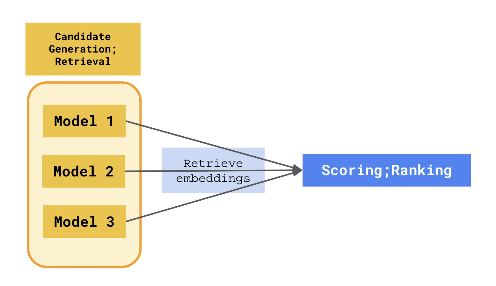

## 1 Problem of Information Overload
All of us are no stranger to search engines and recommender systems. Without them, we would get overwhelmed with the sheer amount of information being created every second. This information could take different data formats - __*text*__, __*images*__, __*audio*__, __*video*__ etc.

Fundamentally, these systems can, given a large catalog of information, surface, filter and rank the relevant items based on the user's query or profile, enabling us to navigate a sea of items, where otherwise users would struggle with information overload.

As the title of this post has already mentioned, we will focus on recommender systems in this article. I might cover system design for search in a separate article in the future, stay tuned.

## 2 Industry Use Cases for RecSys
### Do you need a recommender?
To be fair, 80% of companies will not have the requirement to build a sophisticated recommender system. For small catalogs with a small number of product categories, you can get by just fine using dynamic SQL queries.

If you wanted to build for example, a __"Similar Items to..."__ or __"You might also like..."__ panel on the item description page, you would write a SQL query that retrieved the `top xx items` for the current `category` of item. 

The same applies if you wanted to build a __"Recommended for you..."__ panel on the home page of your website or list of recommended items to be sent in a marketing email. Simply retrieve the top item category the user has viewed over a historical time period, and write the same dynamic SQL query to retrieve the recommended items based on the user's historical interaction data.

Users who are exploring your site would also be able to scan through your entire catalog to find what they are looking for without feeling overwhelmed.



1. __Item catalog size:__
- As catalog size increases, it becomes more tedious and expensive to label each item's metadata through a manual process. 
- In business models such as marketplaces, where item listings are completely crowdsourced to users, it is impossible to ensure high quality item metadata labels. We have to look at alternative methods of generating recommendations outside of simple SQL queries.
---

2. __Lack of structured data:__
- For certain companies, structured data in a tabular format may not even be collected. Instead, they might have a repository of videos, images, free text, articles that could be mined for generating recommendations. 
- Using unstructured data as the basis of that idea requires use of deep neural network approaches that encode unstructured data into structured numerical data to learn meaningful representations.
- __structured__ - data in tabular format with well-defined schema.
- __unstructured__ - `text`, `image`, `audio`, `video`
---

3. __Repeatable process for improving business metrics:__
- Without a repeatable experimentation process, there is no way to test new techniques to improve your recommendations for your users. In addition, there is no way to monitor whether the changes to the system has a tangible impact on key business metrics.
- Recommender systems have been shown to improve business metrics e.g. click-through rates, conversion rates, add-to-cart purchase, new item add-to-cart, listen / watch time,  etc.
- Putting in place your first recommender system does not necessarily guarantee you a repeatable experimentation process to start, but rather is the first step to moving towards that.



### RecSys Case Studies
__Below are some example use cases of recommender systems that are prevalent in society, broken down by industry:__



- eCommerce: [eBay - Building a Deep Learning Based Retrieval System for Personalized Recommendations](https://tech.ebayinc.com/engineering/building-a-deep-learning-based-retrieval-system-for-personalized-recommendations/)
- Retail: [ - ]
- Fashion: [ - ]
- Streaming Media: [ - Tiktok]
- Music: [Spotify - ]
- Videos: [YouTube - ]
- Electronics, Hardware: [Apple - ]
- Social Networks: [Facebook, Linkedin, Instagram - ]
- Food Delivery: [Instacart - ]
- Arts, Museums, Entertainment: [ - ]
- Travel: [AirBnB / Klook - ]
- Leisure and Hospitality: [Resorts World Sentosa - ]
- Online dating: [Tinder -]
- Online gaming: [Steam - ]
- Housing and Apartments: [Zillow - ]
- Leasing and Rentel: [WeWork - ]
- Cars: [Car marketplace - ]
- Employee Engagement and Productivity: [Workday - ]
- Internal IT tickets: [JIRA - ]
- Government Health: [ - ]
- Publishers: [New York Times - ]
- Sports: [FIFA / NBA - ]
- Education: [Schools - ]
- Online Education: [Coursera - ]
- Healthcare: [Novartis - ]
- Financial Services / Trading: [ - ]
- Insurance: [ - ]



### Architecting and Building a RecSys
Often in the real world, IT systems are a collection of services working together. Architecting and building a recommender system is a layered, multi-stage process that uses the right type of model for each stage in the layer. 

Let's take a look at the stages a machine learning engineer goes through when building a recommender system.

## 3 Recommender System Design

The above diagran shows the de-facto standard for building recommender systems. State-of-the-art (SOTA) recommender systems separate the engineering of such a system into this 3-stage process.



Note that at each stage of the process, we also need to think about how to expose or serve the ML model that has been built for downstream consumers to utilize. We will explore this in the subsequent sections as we explain each of the stages.



### Candidate Generation; Retrieval
Candidate generation is also known as the __Retrieval__ stage in some recommender system literature. Item catalogs can potentially grow into the hundred thousands, millions or billions of items. 

Candidate generation methods are able to select the top hundred most relevant items through efficiently comparing the similarity between items using a distance metric. 

The first big idea here is to learn a numerical vector representation of users and item, the input data. These vectors, called embeddings can be written to a database or a nearest neighbors index where they are later retrieved by downstream systems. 

Once we have the user and item embeddings, we can calculate their similarity in the embedding space using distance metrics such as euclidean distance, dot product, cosine similarity etc.

Candidate Generation aims to whittle down the number of potential candidates using an efficient approach that returns hundreds of candidate results that are ranked in the next stage. Usually, multiple candidate generators are built, that are trained using different approaches, each utilizing its own specific set of training data.



A common and valid question to ask here is why not just go straight to the scoring stage? Why go through the process of generating embeddings for candidate generation?

There are several points to consider here:

1. Generating embeddings are a key feature engineering step. The vector values can be re-used downstream as input feature values to further increase the accuracy of the downstream scoring model.

2. Candidate generation models can train on unstructured data, and represent unstructured data attributes of the item or user using a multi-dimensional vector. This useful information, such as `text`, `image`, `audio`, `video`, would otherwise remain untapped.

3. Unsupervised learning with unlabeled training data. In the real world, labeled data is expensive to obtain, and we do not always have the luxury of having explicit labels for our data. Candidate generation approaches do not require labeled data, and are able to extract the latent features of the input data using implicit feedback.

4. Semantic visual understanding of each item or user in the embedding space. You can visualize high-dimensional vectors in a 2-D space using tools such as [TensorBoard Embedding Projector](https://www.tensorflow.org/tensorboard/tensorboard_projector_plugin). By doing so, you also gain the ability to observe, and apply clustering algorithms to discover clusters of similar objects.

5. The output of a candidate generation model aims to establish similarity between items or users. This idea is fundamental in most recommender system products. Examples such as __"Similar Items to..."__ or __"Users similar to you also liked..."__ spring to mind.

6. Fast training process. When re-training a candidate generation model, you can initialize the model with learned embeddings from the previously trained model version. This reduces training time as you only have to learn embeddings for the new items or users. This is assuming user preferences and item attributes change slowly over time.

7. Serve model results efficiently. Serving a candidate generation model is also efficient using an Approximate Nearest Neighbors (ANN) engine. For more information about the ANN algorithm, please refer to the video: [Approximate Nearest Neighbors: Data Science Concepts](https://www.youtube.com/watch?v=DRbjpuqOsjk). __Contrast this with the Scoring stage - where you have the added overhead of computing all the engineered features that went into training the Scoring model, before the API is able to return you the model results.__



As mentioned earlier, serving these embeddings is done via exposing an ANN engine. There are a lot of choices on the market for this, both open source and on public clouds, below are just some of your options:
- Open-Source: [Facebook faiss library](https://github.com/facebookresearch/faiss)
- AWS: [Amazon OpenSearch](https://docs.aws.amazon.com/opensearch-service/latest/developerguide/knn.html)
- GCP: [Vertex AI Matching Engine](https://cloud.google.com/vertex-ai/docs/matching-engine/ann-service-overview)

Simply use one of these services, select your distance similarity metric, and downstream consumers can call the API to retrieve object embeddings.

An alternative approach is to write the object embeddings to a database, and downstream systems query the database to retrieve them. This is essentially what [Spotify does using Cloud Bigtable](https://www.youtube.com/watch?v=807uHC0Ia10).

### Scoring; Ranking
Scoring is also known as the __Ranking__ stage in some recommender system literature. It is stage that happens after candidate generation. A visual representation of this is shown in the diagram below:

After retrieving top hundred candidates from multiple candidate generator models, each candidate's embeddings can be organized into a structured tabular format along with other input data about the item and user such as datetime, category, device type etc. Scoring is a supervised learning problem, so we have to ensure that we pass it labeled training data relevant to the business metric we are optimizing for.



Depending on whether you have labeled training data or not, your company may not have a Scoring stage. This is perfectly fine, and some companies get by with just Candidate Generation stage powering their recommender system products. __It may take more time and effort for your internal data engineering process to put in place the right telemetry to produce labeled training datasets.__



Scoring is a classification problem. The output of the classification model is a probability score that enables you to rank the candidates from most likely to increase the business metric to least likely to do so. Examples of such business metrics include click-through rate, video watch time, item add-to-cart etc.

To serve the output of a Scoring model, you can publish an API endpoint with the model version you would like to deploy. The downstream system would have to call the API with the base input features (we must be careful here to not introduce data leakage), and the Scoring model would calculate the engineered features, before returning a ranked list of items, each with their own probability score.

There are easy options for deploying such an endpoint on all 3 public cloud providers:
- [Azure ML](https://learn.microsoft.com/en-us/azure/machine-learning/concept-endpoints)
- [AWS SageMaker](https://docs.aws.amazon.com/sagemaker/latest/dg/deploy-model.html)
- [GCP Vertex AI](https://cloud.google.com/vertex-ai/docs/predictions/overview)

Similarly, the ranked list of results, if retrieved via a batch endpoint can be cached into a database, for retrieval later by the downstream application.

### Re-Ranking
After ranking your items by assigning them probability scores, systems can also re-rank the ordered list of items. There are several benefits to re-ranking, namely:
1. Item quality - removal of malicious items such as fake / pirated / scam products, poor quality item listings, clickbait etc that could negatively affect user confidence and discourage them from using the platform.
2. Item diversity - Instead of recommending items that users have seen before, we can recommend lesser known item listings, or different categories of items that a user usually looks at to encourage discovery and exploration on the platform.

When you optimize for a business metric, you are prone to [metric corruption](https://www.nngroup.com/articles/campbells-law/) - you encourage certain malicious behaviours from bad actors. The re-ranking stage serves to mitigate that, by considering other metrics that are complimentary to the primary one that was optimized for during the Scoring stage. 

The process of Re-Ranking could be simple business rules to ensure mandatory fields for an item is filled in, or you could train a separate model that can learns characteristics of the bad actors or items with malicious intent. Serving these models would be similar to the approach described in the Scoring stage.

To promote new item discovery on your platform, and encourage diversity, companies also utilize variants of multi-armed bandit algorithms when serving the ranked item list to end users, to strike a balance between exploration vs. exploitation of items, but that's a topic that warrants a dedicated blog post for another time.

___
## Special Thanks / References
A special mention and thanks to the authors and creators of the following resources, that helped me to write this post:
- 📚 [Google Developers Recommendation Systems Course](https://developers.google.com/machine-learning/recommendation)
- 🎦 [Approximate Nearest Neighbors: Data Science Concepts](https://www.youtube.com/watch?v=DRbjpuqOsjk)
- 🎦 [Spotify Music Recommendations at Scale with Cloud Bigtable](https://www.youtube.com/watch?v=807uHC0Ia10)

